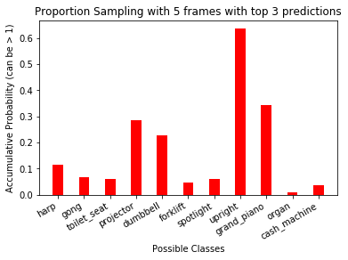

## Author
Xinran Li xil767@eng.ucsd.edu  
Hanyin Wang haw061@eng.ucsd.edu  
Siyi Wang swang@eng.ucsd.edu  
Yu Zhong yuz871@eng.ucsd.edu

## Requirements
Python: 3.6 
Tensorflow-gpu: 1.4+  
Keras: 2.1.4 + 
 
[Youtube Video Frames Generator](https://github.com/gsssrao/youtube-8m-videos-frames/tree/4b4c35e8698a3b4222a680f5ad1e8df37b7cbe66)  
[youtube-dl](https://github.com/rg3/youtube-dl#installation)  
[ffmpeg](https://www.ffmpeg.org/download.html)

## Instructions
The IPython Notebook contains the researches on influences of different sampling methods and hyperparameters. Please follow the instructions below to experience the demo.  

**If you do not have frames picture:**  

1. Open the .ipynb
2. Adjust the hyperparameters according to your need.
3. Run the entire block.

**If you do have frames picture:**  
1. Transfer your frame pictures into `frames` folder, overwrite all the previous files.
2. Open the .ipynb
3. Adjust the hyperparameters according to your need.
4. Run the entire block

## Sample Results

